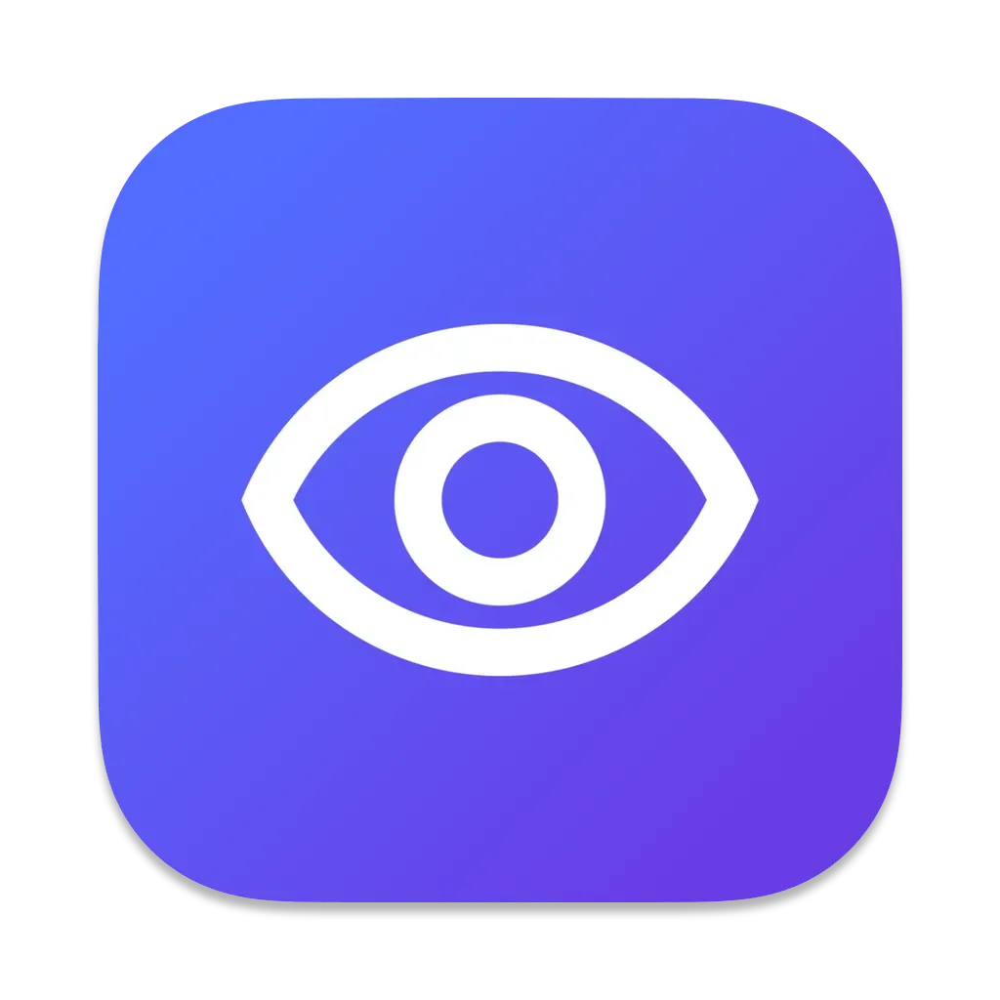
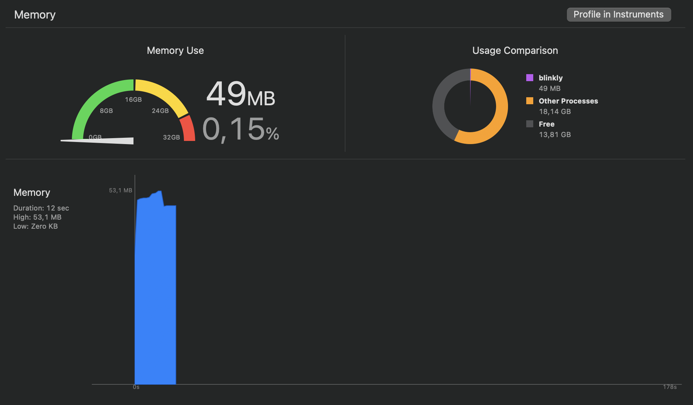
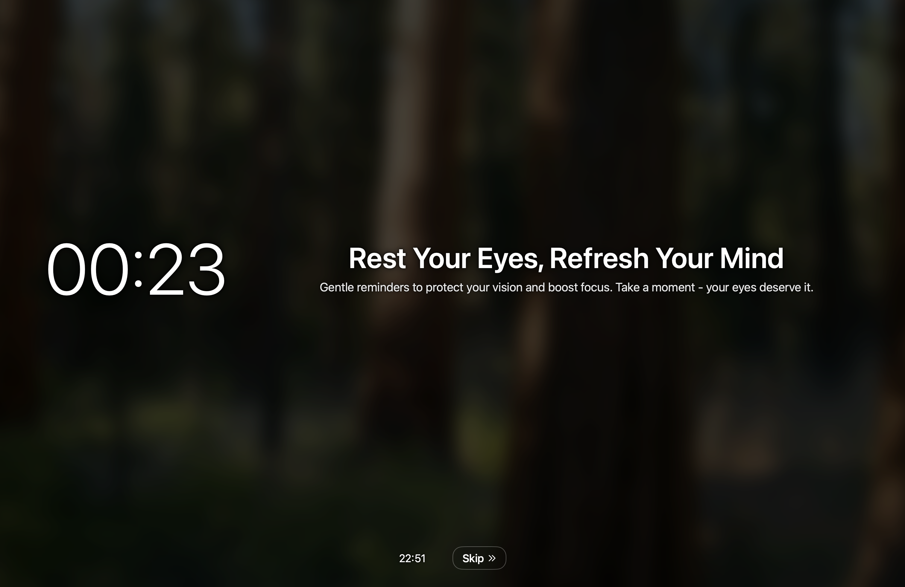

# Blinkly 👀

<div align="center">
  
</div>

**A macOS menu bar app for healthy eye habits with smart media control**


## ✨ Features

<div align="center">
  
</div>

- **🎯 Eye Break Reminders**: 30-second break intervals (demo mode)
- **🎵 Smart Media Control**: Automatically pauses/resumes Spotify, Apple Music, browsers
- **📺 Multi-Screen Support**: Break overlays on all connected displays
- **🖱️ Cursor Tracking**: Floating countdown follows your mouse
- **👁️ Blink Reminders**: Configurable blink and posture reminders
- **📱 Menu Bar Only**: No dock icon, clean menu bar integration

## 📱 Preview

<div align="center">
  
</div>

## 🚀 Installation

### Download Universal Binary (Supports All Macs)

**Latest Release: v1.1.0** - Universal binary for both Apple Silicon and Intel Macs

### Option 1: Download DMG (Recommended)

1. Download `blinkly-v1.1.0-universal.dmg` from [Releases](../../releases/latest)
2. Open the DMG and drag Blinkly to Applications
3. Launch from Applications or Spotlight

### Option 2: Download ZIP

1. Download `blinkly-v1.1.0-universal.zip` from [Releases](../../releases/latest)
2. Extract and move `blinkly.app` to Applications
3. Right-click → Open (first time only for security)

### ✅ Compatibility

- **Apple Silicon Macs**: M1, M2, M3, M4 (native ARM64)
- **Intel Macs**: All Intel-based Mac models (native x86_64)
- **No Rosetta Required**: Runs natively on all architectures

## 🎮 Usage

1. **Launch**: Blinkly appears as a menu bar icon (👁️)
2. **Start Break**: Click "Start Break Now" or wait for auto-timer
3. **Settings**: Access via menu bar → "⚙️ Settings..."
4. **Break**: Full-screen overlay with countdown and smart media pause
5. **Resume**: Media automatically resumes after break

## ⚙️ Settings

- **Break Intervals**: Configure break frequency
- **Reminder Types**: Enable/disable blink and posture reminders
- **Media Control**: Automatic pause/resume settings
- **Display Options**: Multi-screen overlay preferences

## 🔧 Technical Details

- **Platform**: macOS 15.5+ (Universal Binary)
- **Architectures**: ARM64 (Apple Silicon) + x86_64 (Intel)
- **Languages**: Swift, SwiftUI, AppKit
- **Media Integration**: AppleScript for Spotify, Apple Music, browsers
- **Build**: Xcode 16.6, Code Signed
- **Performance**: Native execution on all Mac architectures

## 🛠️ Development

### Building from Source

```bash
git clone https://github.com/noirrs/blinkly.git
cd blinkly
open blinkly.xcodeproj
```

### Requirements

- Xcode 16.0+
- macOS 15.5+ deployment target
- Swift 5.0+
- Universal binary support (ARM64 + x86_64)

## 📝 Release Notes

### v1.1.0 (Latest) - Universal Binary Release

- 🎯 **Universal Binary**: Native support for both Apple Silicon (ARM64) and Intel (x86_64)
- ⚡ **Optimized Performance**: No Rosetta 2 translation required
- 🔧 **Enhanced Compatibility**: Single app bundle works on all Mac models
- 📦 **Release Assets**: DMG installer and ZIP archive available
- 🏗️ **Built with**: Xcode 16.6, macOS 15.5+ target

### v1.0.2

- ✅ Fixed app launch crashes
- ✅ Eliminated unwanted window opening
- ✅ Removed dock item appearance
- ✅ Optimized break overlay performance (instant appearance)
- ✅ Async media detection (no UI blocking)
- ✅ Accurate media state tracking

## 📄 License

MIT License - see [LICENSE](LICENSE) file for details.

## 🤝 Contributing

1. Fork the repository
2. Create a feature branch
3. Make your changes
4. Test thoroughly
5. Submit a pull request

## 💖 Support

If Blinkly helps your eye health, consider:

- ⭐ Starring the repository
- 🐛 Reporting bugs via Issues
- 💡 Suggesting features
- 🔄 Sharing with others

---

**Made with ❤️ for healthier screen time**
